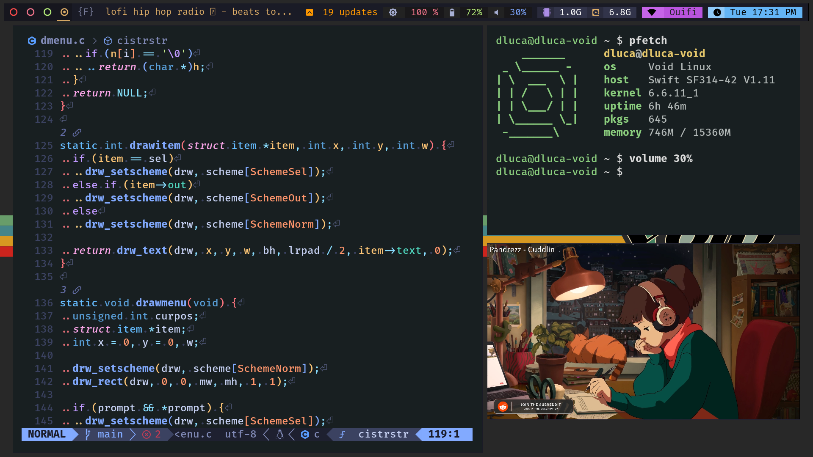
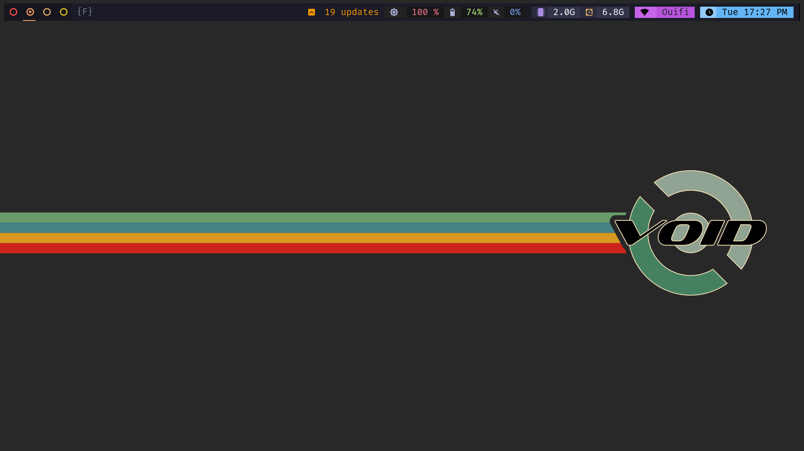

# void-dotfiles
VoidLinux personal and minimal dotfile  

## Philosophy:
Follows Unix philosophy: Keep it simple stupid.  

## Info

- OS: Void Linux x86_64 (GLibC)
- WM: Dwm
- Term: St
- Bar: Dwm with Slstatus
- Launcher: Dmenu
- Shell: yash
- Editor: Neovim (in my other dotfile repo, heavily bloated as it is my main editor for coding)
- Font: Fira Code Nerd Font

## Screenshots




## Prerequisites

Unix based system  
X11 (minimal)  
dbus  
A seat manager (elogind)
[Fira Code Nerd Font](https://www.nerdfonts.com/font-downloads) (I use this font in dwm, slock, st. Can be changed in config header file)  
Everything should work on a musl system be I didn't tested it  

## Dependencies

- stow
- make
- git

- libX11-dev
- libXft-dev
- libXinerama-dev
- libXext-dev
- libXrender-dev
- imlib2-dev
- libharfbuzz-dev
- gd-dev
- freetype2-dev
- fontconfig-dev
- xset
- xrandr

## Installation

For VoidLinux base system (otherwise check dependencies):  
```
xbps-install -Su\
        libX11-devel\
        libXft-devel\
        libXinerama-devel\
        libXext-devel\
        libXrender-devel\
        imlib2-devel\
        harfbuzz-devel\
        gd-devel\
        freetype-devel\
        fontconfig-devel\
        xset\
        xrandr\
        stow\
        make\
        git
```
Then clone the repo  
```
git clone https://github.com/ElBretzel/void-dotfile
cd void-dotfile
make
```

## Run

```
startx
```

# Display Manager

If you use a display manager like Lightdm, you must create a desktop entry  

```
echo "[Desktop Entry]\
Encoding=UTF-8\
Name=dwm\
Comment=Dynamic window Manager\
Exec=dwm\
Icon=dwm\
Type=XSession" > /usr/share/xsessions/dwm.desktop
```

## Suckless patches' (so far)

### DWM:

* [attach bellow](https://dwm.suckless.org/patches/attachbelow/)  
* [auto start](https://dwm.suckless.org/patches/autostart/)  
* [bar padding](https://dwm.suckless.org/patches/barpadding/)  
* [cfacts](https://dwm.suckless.org/patches/cfacts/)  
* [exit menu](https://dwm.suckless.org/patches/exitmenu/) (works with elogind managed session, otherwise edit exitdwm.c)  
* [hide vacant tag](https://dwm.suckless.org/patches/hide_vacant_tags/)  
* [pertag](https://dwm.suckless.org/patches/pertag/)  
* [restartsig](https://dwm.suckless.org/patches/restartsig/)  
* [status2d](https://dwm.suckless.org/patches/status2d/) (used with my slstatus config)  
* [underline tag](https://dwm.suckless.org/patches/underlinetags/)  
* [vanity gaps](https://dwm.suckless.org/patches/vanitygaps/) (everything is included but I only use fibonacci, feel free to modify)  
* [zoomswap](https://dwm.suckless.org/patches/zoomswap/)  
And some personal modifications such as bar height and bar workspace dot skin  

### ST

st build took from [siduck](https://github.com/siduck/st) (didn't touched)  
I like his build right now. When I will have time, I will do some minor tweaking  

### Slstatus

No patch but custom made scripts (I tried to not hardcode so it should work on all systems except for the 3 following scripts)  
The xbps script only works for VoidLinux base system: it fetches all updatable packages and show the total number.  
The connection script works if Network Manager is installed (you can delete or 
change the script to remove the connection name's variable if you don't have Network Manager)  
The volume script works if pipewire and wireplumber is installed. You can change 
this script if you have Pulseaudio or Alsa  

I coded a small "plugin" to integrate CAVA bar into slstatus in C. It is still
experimental but I like it as it is.  
If you don't want my integration, just keep the config.def.h file and fetch 
the original slstatus.c file from suckless repository.  

### Slock

* [auto timeoff](https://tools.suckless.org/slock/patches/auto-timeout/)  
* [blur pixelated screen](https://tools.suckless.org/slock/patches/blur-pixelated-screen/)  
* [caps color](https://tools.suckless.org/slock/patches/capscolor/) with personal modification  
* [dwm logo](https://tools.suckless.org/slock/patches/dwmlogo/) changed to VoidLinux logo  
* [dpms](https://tools.suckless.org/slock/patches/dpms/)  

I also modified source of Slock  
I plan change dwmlogo patch because it is very painful to create custom logo  

### Dmenu

* [borders](https://tools.suckless.org/dmenu/patches/border/)
* [center](https://tools.suckless.org/dmenu/patches/center/)
* [fuzzymatch](https://tools.suckless.org/dmenu/patches/fuzzymatch/)
* [fuzzymatch highlight](https://tools.suckless.org/dmenu/patches/fuzzyhighlight/)
* [lineheight](https://tools.suckless.org/dmenu/patches/line-height/)
* [numbers](https://tools.suckless.org/dmenu/patches/numbers/)

## Credits

st build took from [siduck](https://github.com/siduck/st) (go check his
works)  
dwm build look inspired by [siduck chadwm](https://github.com/siduck/chadwm/)  
[dwm's colorful tag patch](https://github.com/fitrh/dwm/issues/1) from fitrh  
